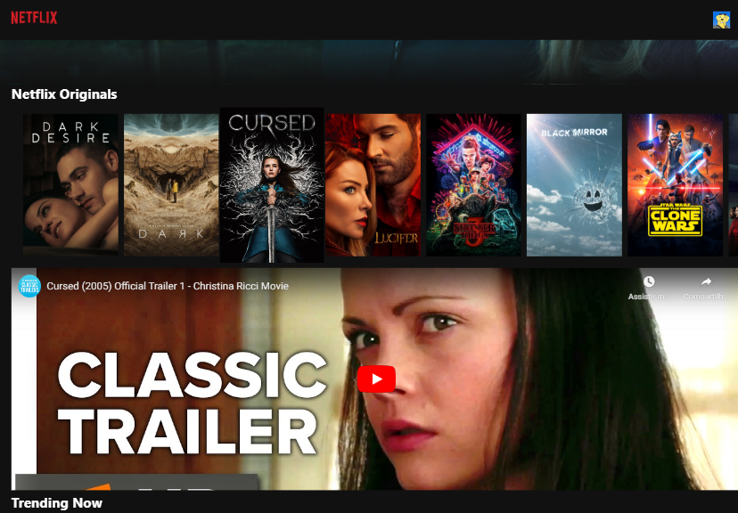

<h1 align="center">Netflix-clone ⚛️</h1> 
<p>
    
    
</p>

### Getting Started :computer:

```sh 
git clone https://github.com/muNeves3/Netflix-clone
```

## Install

```sh
yarn install
```

## Usage

```sh
yarn run start
```

## Run tests

```sh
yarn run test
```

## Tecnologies used in this project :rocket:

- [x] React
- [x] Axios
- [x] Firebase

## Author

-> Original 👤 **CleverProgrammer(Rafeh Qazi)**
- Github : [@CleverProgrammer](https://github.com/CleverProgrammer)

👤 **Murilo Neves**

- Twitter: [@__muriloneves__](https://twitter.com/_muriloneves_)
- Github: [@muNeves3](https://github.com/muNeves3)
- Email: [murilogrilosn@gmail.com](mailto:murilogrilosn@gmail.com)
